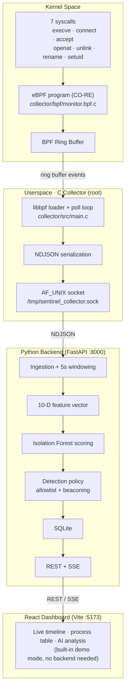
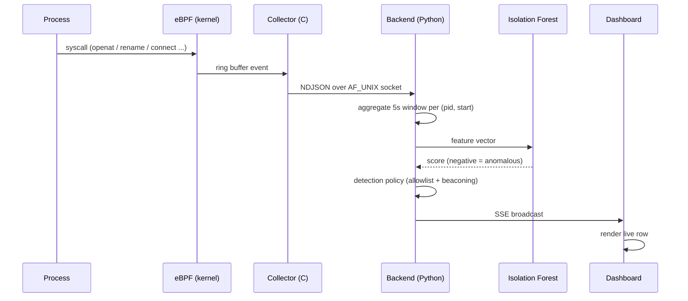

<div align="center">

# 🛡️ eBPF Sentinel

**Real-time behavioral anomaly detection for the Linux kernel**

A host-based intrusion detection system (HIDS) that watches processes inside the kernel with **eBPF (CO-RE)**, scores every 5-second activity window with an **Isolation Forest**, and streams live alerts to a **React dashboard**.


**Behavioral, not signature-based.** No hash databases, no IOC feeds — Sentinel learns what *normal* looks like on the host and flags the statistical outliers: ransomware file-thrashing, C2 beaconing, privilege escalation, zero-days.

</div>

---

## Table of Contents

- [Why eBPF Sentinel?](#-why-ebpf-sentinel)
- [System Architecture](#-system-architecture)
- [How Detection Works](#-how-detection-works)
- [Threat Detection Capabilities](#-threat-detection-capabilities)
- [Repository Structure](#-repository-structure)
- [Quick Start](#-quick-start)
- [Configuration](#-configuration)
- [API Reference](#-api-reference)
- [Simulating Attacks & Verification](#-simulating-attacks--verification)
- [Dashboard Features](#-dashboard-features)
- [Running Tests](#-running-tests)
- [Known Limitations](#-known-limitations)

---

## 💡 Why eBPF Sentinel?

### The core problem

Traditional security software inspects files on disk or listens in user space:

1. **Signatures are reactive.** A one-byte change to malware breaks its hash — every signature-based product misses the modified variant.
2. **User-space inspection is slow and bypassable.** An attacker with elevated privileges can tamper with user-space agents or hide their activity.

### The Sentinel answer

Sentinel runs **inside the Linux kernel** with eBPF — a sandboxed, just-in-time compiled C program that hooks security-relevant syscalls at native speed:

```
Traditional antivirus:  "Is this file hash bad?"             ❌ misses zero-days
eBPF Sentinel:          "Why did a text editor just open 500
                         files and rename them to .locked
                         in 2 seconds?"                      🚨 catches ransomware
```

- **Zero overhead & tamper-proof** — sandboxed in the kernel, no kernel module, verified by the verifier before load.
- **Behavior over signatures** — "is this process behaving weirdly *compared to this host's normal history*?"

---

## 🏗️ System Architecture

Three physically separated tiers communicating over well-defined wire formats — a kernel eBPF collector, a Python analysis backend, and a React dashboard.



### One scored window, end to end



---

## 🧠 How Detection Works

### 1. Kernel event capture (C + eBPF CO-RE)

`collector/bpf/monitor.bpf.c` hooks 7 security-critical syscalls:

| Syscall | What it reveals |
|---|---|
| `execve` | Process execution and lineage |
| `connect` / `accept` | Outbound connections / inbound listeners |
| `openat` | File access |
| `unlink` / `rename` | Deletions and extension changes (ransomware indicators) |
| `setuid` | Privilege escalation |

Every hit pushes process metadata (`pid`, `ppid`, `comm`, filename, IP/port) into a loss-resistant **BPF ring buffer**.

### 2. High-speed host ingestion (C collector)

`collector/src/main.c` loads the program with **libbpf + CO-RE** (compile once, run on any BTF-enabled kernel), polls the ring buffer, serializes events to **NDJSON**, and streams them over a Unix domain socket.

### 3. Windowing & feature engineering (Python)

Raw syscall logs are noisy, so the backend buckets events into **5-second windows per process** and computes a **10-dimensional behavior vector**:

`num_execve` · `num_distinct_children` · `num_file_opens` · `num_file_renames` · `num_file_deletes` · `num_distinct_files_touched` · `num_connect` · `num_distinct_dest_ips` · `num_setuid` · `syscall_rate`

### 4. Unsupervised anomaly scoring (Isolation Forest)

Each vector is scored by an Isolation Forest: normal processes sit in dense regions (deep leaves), outliers isolate with very few random splits (shallow leaves). A low `decision_function()` value = anomalous. **The model is only as good as its baseline** — it is trained on `baseline.csv` captured from the host's own normal traffic.

### 5. Detection policy (post-model rules)

Rules the model *cannot* learn from count aggregates: a static **daemon allowlist** suppresses OS-kernel noise (udevd hotplug bursts), and a **beaconing rule** promotes single-destination connect bursts (C2) that look normal to the forest.

### 6. ML explainability

Every flagged window can answer *"why?"* — `FeatureAnalyzer` compares each feature to the baseline (z-scores) and surfaces the top contributors: file renaming → ransomware, network fan-out → C2, privilege changes → escalation.

### 7. Live visualization (FastAPI + React)

Scored windows persist to SQLite and broadcast to the dashboard over **Server-Sent Events**. Analysts see a live anomaly timeline, a per-process threat table, and per-process AI analysis.

---

## 🎯 Threat Detection Capabilities

| Threat Type | Behavioral Indicator | Sentinel Feature Signal |
| :--- | :--- | :--- |
| **Ransomware / file thrashing** | Rapid opens, renames (e.g. `.locked`), deletions | High `num_file_renames`, `num_file_deletes`, `syscall_rate` |
| **C2 beaconing / exfiltration** | Periodic rapid connects to a few IPs | High `num_connect`, low `num_distinct_dest_ips` |
| **Privilege escalation** | Unexpected `setuid` execution | High `num_setuid`, `execve` |
| **Web shell / suspicious lineage** | Web server spawning `sh`/`bash` | Abnormal `ppid → comm` lineage, `num_execve` |

---

## 📁 Repository Structure

```
sentinel/
├── collector/                     # Kernel eBPF collector (C / libbpf)
│   ├── bpf/monitor.bpf.c          # Kernel-space eBPF program (7 tracepoints)
│   ├── bpf/vmlinux.h              # Generated kernel BTF headers (per-kernel)
│   ├── src/main.c                 # Loader, ring-buffer poll, NDJSON socket
│   ├── src/events.h               # Shared C event struct (byte-for-byte contract)
│   ├── Makefile
│   └── run.sh                     # Root launcher (pre-flight checks)
├── backend/                       # Python analysis pipeline & API
│   ├── sentinel_backend/
│   │   ├── config.py              # Env config (does NOT auto-load .env)
│   │   ├── pipeline.py            # ingestion → windowing → ML → DB → broadcast
│   │   ├── ingestion/             # Socket client + 5s window aggregator
│   │   ├── features/vector.py     # The 10-feature contract (single source of truth)
│   │   ├── ml/                    # train.py · inference.py · detection_policy.py · explain.py
│   │   ├── db/                    # SQLite ORM, retention, lazy session
│   │   └── api/                   # FastAPI: REST + SSE + bearer auth
│   ├── baseline.csv               # Training baseline (real host windows)
│   └── tests/
├── frontend/                      # React + Vite dashboard (TypeScript)
│   └── src/
│       ├── hooks/                 # SSE consumer (with demo mode)
│       ├── lib/                   # config, severity mapping, formatters
│       └── pages/                 # Dashboard, Threats, How It Works, About
└── test/                          # Safe attack simulators + offline verification
    ├── simulate_ransomware.py
    ├── simulate_beaconing.py
    └── verify_detection.py        # Offline end-to-end check (no root needed)
```

---

## 🚀 Quick Start

### Prerequisites

- **OS:** Linux, kernel ≥ 5.8 with **BTF** enabled (tested on Fedora)
- **Toolchain:** `clang`, `llvm`, `libbpf-devel`, `bpftool`, `gcc`, `make`
- **Runtimes:** Python ≥ 3.11, Node.js ≥ 18

### Option A — Full pipeline (eBPF collector + ML)

**1. Install dependencies**

```bash
sudo dnf install -y clang llvm libbpf-devel bpftool elfutils-libelf-devel \
  kernel-devel make gcc python3.12 nodejs npm
```

**2. Generate kernel BTF headers** (kernel-specific — regenerate per machine)

```bash
sudo bpftool btf dump file /sys/kernel/btf/vmlinux format c > collector/bpf/vmlinux.h
```

**3. Build the collector**

```bash
cd collector && make
```

**4. Set up the Python backend**

```bash
cd ../backend
python3 -m venv .venv && source .venv/bin/activate
pip install -r requirements.txt
```

**5. Configure environment**

```bash
cp .env.example .env
# set a real token:
#   API_AUTH_TOKEN=$(openssl rand -hex 32)
```

**6. Train the ML model** (rerun if `FEATURE_COLUMNS` or the host workload changes)

```bash
python -m sentinel_backend.ml.train baseline.csv
```

**7. Run the three tiers** — three terminals:

```bash
# a) eBPF collector (requires root). Keep the terminal open, or run detached:
cd collector && sudo ./run.sh
# detached alternative:
#   sudo sh -c 'nohup ./build/sentinel_collector > /tmp/sentinel_collector.log 2>&1 &'
```

```bash
# b) Backend — the token MUST be exported in this shell (config does not load .env)
cd backend && source .venv/bin/activate
export API_AUTH_TOKEN=<same token as frontend/.env>
uvicorn sentinel_backend.api.main:app        # http://localhost:8000
```

```bash
# c) Frontend
cd frontend && npm install && npm run dev    # http://localhost:5173
```

Dashboard: **http://localhost:5173** · API docs: **http://localhost:8000/docs**

> ⚠️ **Gotchas learned the hard way:**
> - `config.py` does **not** auto-load `.env`. Start uvicorn from a shell without `API_AUTH_TOKEN` exported and *every* authed route 500s (fail-closed) while `/health` stays green — the dashboard looks dead for no obvious reason.
> - The model loads **once at startup**. After retraining, restart the backend.
> - The backend auto-reconnects to the collector socket every 2s — restarting the collector does **not** require a backend restart (and vice-versa).
> - The collector runs as root and dies if its terminal closes — run it detached (above) for a daemon that survives.

### Option B — Frontend demo mode (no backend, no root)

```bash
cd frontend && npm install && npm run dev
```

Open `http://localhost:5173` — the dashboard generates realistic mock data (~20% anomalies) and shows **Demo Mode** in the connection badge. Great for evaluating the UI without the kernel stack.

---

## ⚙️ Configuration

`.env.example` documents every variable; `.env` is gitignored.

| Variable | Default | Description |
|---|---|---|
| `API_AUTH_TOKEN` | *(required)* | Bearer token for API auth — fails closed if unset |
| `SENTINEL_DB_PATH` | `backend/sentinel.db` | SQLite database path (resolved from backend root) |
| `SENTINEL_SOCKET_PATH` | `/tmp/sentinel_collector.sock` | Collector Unix socket path |
| `SENTINEL_WINDOW_SECONDS` | `5` | Aggregation window duration |
| `ISOLATION_FOREST_CONTAMINATION` | `0.02` | Expected proportion of outliers (global sensitivity knob) |
| `SENTINEL_MODEL_PATH` | `backend/sentinel_backend/ml/model_store/isolation_forest.joblib` | Trained model location |
| `VITE_API_BASE` *(frontend)* | `http://localhost:8000` | Backend API URL |
| `VITE_API_TOKEN` *(frontend)* | *(same as `API_AUTH_TOKEN`)* | Token sent with frontend requests |

---

## 📡 API Reference

All endpoints except `/health` require `Authorization: Bearer <API_AUTH_TOKEN>`.

```bash
curl -H "Authorization: Bearer $API_AUTH_TOKEN" http://localhost:8000/api/v1/windows
```

| Endpoint | Method | Description |
|---|---|---|
| `/health` | GET | Health check (no auth) |
| `/api/v1/windows` | GET | List windows (`limit`, `pid`, `anomalous_only`) |
| `/api/v1/windows/{id}` | GET | Single window details |
| `/api/v1/windows/{id}/analysis` | GET | ML explainability (per-feature z-scores) |
| `/api/v1/processes` | GET | Aggregated process summary |
| `/api/v1/stats` | GET | Live dashboard stats |
| `/api/v1/stream` | GET | SSE live event stream (also accepts `?token=`) |

> The SSE stream accepts the token as a query param too (`?token=`) because the browser's native `EventSource` cannot set headers.

---

## 🧪 Simulating Attacks & Verification

Safe, self-contained simulators — they touch only an isolated temp dir and loopback.

```bash
# Ransomware-style file thrashing: create → rename to .locked → delete, 500 files
python test/simulate_ransomware.py

# C2 beaconing: rapid loopback connects to few IPs
python test/simulate_beaconing.py

# Offline end-to-end check (scores sim vectors against the model + policy, no root)
backend/.venv/bin/python test/verify_detection.py
```

---

## 🖥️ Dashboard Features

| Feature | Description |
|---|---|
| **Threat level indicator** | NOMINAL / THREAT status with animated pulse |
| **Stat cards** | Live counts: processes, anomalies, syscall density |
| **Anomaly timeline** | Area chart of anomaly scores with threat threshold + tooltips |
| **Process table** | Live per-process rows, searchable, CRITICAL / SUSPICIOUS / BENIGN badges |
| **AI analysis panel** | Per-window explainability: top contributors, z-scores, feature vector |
| **Process detail drawer** | Behavioral vector + AI analysis per process |
| **Simulation guide** | In-dashboard copy-paste commands for the simulators |
| **Connection status** | Live / Reconnecting / Demo Mode indicator |

---

## 🧪 Running Tests

```bash
cd backend && source .venv/bin/activate
pytest tests/ -v
ruff check . && ruff format .
```

---

## 📌 Known Limitations

- **7 syscalls only.** Behavior via unhooked syscalls (`mmap`-only payloads, `sendfile`, `io_uring`) is invisible.
- **Model sensitivity is baseline-bound.** The Isolation Forest is only as good as `baseline.csv`: it must reflect *this host's* normal traffic, or it cries wolf (see §7.4.2 in `project.md` for the regeneration recipe). Count-aggregate 5s features are structurally blind to setuid and periodic single-destination beaconing.
- **Trusted daemons are trusted.** The allowlist suppresses OS daemons by design — a compromised daemon is trusted.

---

## 🛡️ License & Acknowledgments

Developed as an open-source demonstration of kernel-level security engineering, eBPF systems programming, and modern behavioral malware detection.
